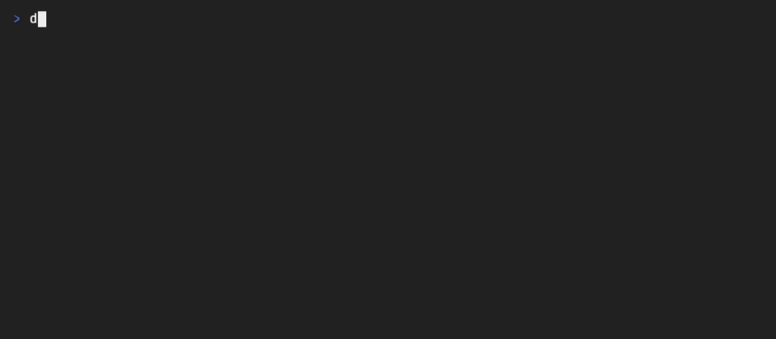

# Dotlad

[](https://github.com/vkarabinovych/dotlad/actions/workflows/ci.yml)
[](https://github.com/vkarabinovych/dotlad/releases/latest)
[](#requirements)
[](#requirements)
[](LICENSE)

Dotlad is a manifest-driven macOS, Linux, and WSL CLI for installing packages
and deploying dotfiles from a repository. It provides one interface for
inspecting state, previewing changes, applying tools, and restoring replaced
files.



## Why Dotlad

- Preview package and config actions before changing the machine.
- Apply every tool, a reusable profile, or an explicit selection.
- Run package-only or config-only workflows from the same manifests.
- Preserve machine-local JSON, TOML, and Git values with named resolvers.
- Maintain source-backed blocks inside larger machine-local files.
- Deploy files or directories as repository symlinks when direct editing is preferred.
- Back up replaced files automatically and restore them from the CLI or picker.
- Use the same runtime as a standalone command or a pinned Git submodule.

Dotlad deploys in one direction: project → system. The repository remains the
source of truth; Dotlad never captures live configuration back into the project.

## Requirements

Dotlad supports macOS, Linux, and WSL while remaining compatible with the stock
Bash 3.2 shipped with macOS. It has no TUI framework dependency. A real
terminal enables the interactive picker; `--plain` provides a read-only state
view for scripts and non-interactive shells.

A Nerd Font is optional but recommended for the picker's branding and
manifest-defined icons. Without one, state and keyboard behavior still work,
but icon glyphs may use the terminal's missing-character fallback.

Runtime dependencies are scoped to each tool and its resolver:

- Homebrew on macOS or Linuxbrew on Linux and WSL installs declared `BREW`
  packages and missing resolver or manifest-defined requirements.
- `curl` is required when an HTTPS installer must run.
- `sha256sum` or `shasum` is required by checksum-pinned installers.
- `jq`, `yq`, or `git` is required only by the corresponding merge resolver.

Built-in resolvers declare their own commands. Use `REQUIRES` only for
additional commands needed by a particular tool's config deployment.

## Install

Install the self-contained command under `~/.local`:

```bash
git clone https://github.com/vkarabinovych/dotlad.git
cd dotlad
./install.sh
export PATH="$HOME/.local/bin:$PATH"
dotlad --version
```

Add `~/.local/bin` to your shell startup file to keep it on `PATH`. After
updating the checkout, rerun `./install.sh` to replace the managed runtime.
`./install.sh --uninstall` removes only the managed command and runtime.

Use `./install.sh --prefix /absolute/path` to select another installation
prefix. The installer refuses to overwrite an unmanaged `bin/dotlad`.

## Create a first project

A Dotlad project needs a `tools/` directory. Each tool has a strict,
non-executable `tool.conf` and may include one or more config payloads:

```bash
mkdir -p "$HOME/dotfiles/tools/starship/files"

cat > "$HOME/dotfiles/tools/starship/files/starship.toml" <<'EOF'
format = "$directory$character"
EOF

cat > "$HOME/dotfiles/tools/starship/tool.conf" <<'EOF'
NAME="starship"
DESC="Cross-shell prompt configuration."
ICON="★"
PLATFORMS="macos linux"
BREW="starship"
[config.main]
SOURCE="files/starship.toml"
DEST="$HOME/.config/starship.toml"
EOF
```

Inspect the project and preview the exact action before applying it:

```bash
dotlad -C "$HOME/dotfiles" --plain
dotlad -C "$HOME/dotfiles" plan starship
dotlad -C "$HOME/dotfiles" starship
```

The first two commands are read-only. The final command shows a diff, asks for
confirmation, installs the package when missing, backs up an existing
destination, and deploys the config.

Run `dotlad -C "$HOME/dotfiles"` without a command to open the picker. `-C` is
optional when the current directory is already the project root.

## Project model

```text
my-dotfiles/
├── tools/
│   └── starship/
│       ├── tool.conf
│       └── files/starship.toml
└── profiles/
    └── base.conf
```

Tools may declare packages, one or more named config sections, or both. Each
`[config.<name>]` chooses its own `SOURCE`, `DEST`, and optional `RESOLVER`.
`PLATFORMS` limits a tool to `macos`, `linux`, or `wsl`. Omitting it keeps the
default `macos linux`; Linux tools also run on WSL, while `wsl` selects WSL
only. Homebrew casks must explicitly use `PLATFORMS="macos"`.
The resolver defaults to `copy`, which copies a file or mirrors a directory
exactly. Use `symlink` to point a destination at the repository source, or a
merge resolver for machine-local file values. The `inject` resolver maintains
one metadata-marked source block while preserving the rest of a destination.

Profiles are optional named tool selections with single-parent inheritance:

```bash
# profiles/base.conf
extends=""
tools="starship git nvim"
```

See [Adding or changing a tool](docs/adding-a-tool.md),
[Profiles](docs/profiles.md), and the [complete example project](examples/)
for the schemas, validation rules, and copy, mirror, merge, symlink,
multi-config, and package-only manifests.

## CLI at a glance

| Command                           | Purpose                                     |
| --------------------------------- | ------------------------------------------- |
| `dotlad`                          | Open the interactive tool picker            |
| `dotlad --plain`                  | Print read-only tool and backup state       |
| `dotlad <tool>…`                  | Apply named tools                           |
| `dotlad profile <name>`           | Apply a profile and inherited tools         |
| `dotlad all`                      | Apply every tool                            |
| `dotlad plan [target]`            | Preview actions, requirements, and blockers |
| `dotlad --dry-run <action>`       | Plan a normal tool/profile/all action       |
| `dotlad brewfile`                 | Generate a Homebrew Bundle file             |
| `dotlad backups`                  | List available restore points               |
| `dotlad restore <name>`           | Restore a restore point                     |
| `dotlad backup delete <name>`     | Delete a restore point                      |
| `dotlad --packages-only <action>` | Install packages without deploying config   |
| `dotlad --config-only <action>`   | Deploy config without installing packages   |
| `dotlad --symlink <action>`       | Default implicit config deployment to links |

See the [CLI reference](docs/cli.md) for option scope, JSON plans, picker
controls, automation behavior, and exit statuses.

## Use as a pinned submodule

A consumer project can pin Dotlad instead of requiring a global installation:

```bash
git submodule add https://github.com/vkarabinovych/dotlad.git vendor/dotlad
git submodule update --init --recursive
```

Expose a project-local wrapper:

```bash
#!/usr/bin/env bash
set -euo pipefail
ROOT="$(cd "$(dirname "${BASH_SOURCE[0]}")" && pwd)"
export DOTLAD_COMMAND_NAME="my-dotfiles"
export DOTLAD_DISPLAY_NAME="My Dotfiles"
exec "$ROOT/vendor/dotlad/dotlad" "$@" \
    -C "$ROOT" --backup-root "$HOME/.my-dotfiles-backup"
```

The standalone command and embedded entrypoint load the same runtime code.

## Safety model

Before deployment, Dotlad validates every manifest and the complete selected
batch. Destinations must be non-overlapping strict descendants of `$HOME`, and
existing parent symlinks cannot redirect writes outside it. Source payloads
cannot contain symlinks or special filesystem entries.

File writes are atomic. Directory tools are staged and swapped as a
transaction; their destinations are exact mirrors, so stale files are backed
up and pruned. Symlinks are also staged and swapped, and the repository must
remain at the same absolute path while they are deployed. Merge resolvers
retain unrelated live values while repository-declared values win. Restore
operations back up the current version before replacing it.

Use `dotlad plan` for a read-only preflight and keep `--yes` for reviewed
automation rather than exploratory runs.

## Documentation

- [CLI reference](docs/cli.md) — commands, options, plans, and picker controls
- [Adding or changing a tool](docs/adding-a-tool.md) — schema and deployment semantics
- [Profiles](docs/profiles.md) — reusable selections and inheritance
- [Troubleshooting](docs/troubleshooting.md) — common setup and preflight failures
- [Architecture](docs/architecture.md) — runtime boundaries and execution flow
- [Development and releases](docs/development.md) — validation, packaging, and release process

## Development

```bash
/bin/bash scripts/check.sh
/bin/bash tests/run.sh
```

See [CONTRIBUTING.md](CONTRIBUTING.md) for the development workflow and
[SECURITY.md](SECURITY.md) for private vulnerability reporting. Release notes
are maintained in [CHANGELOG.md](CHANGELOG.md).

Released under the [MIT License](LICENSE).
