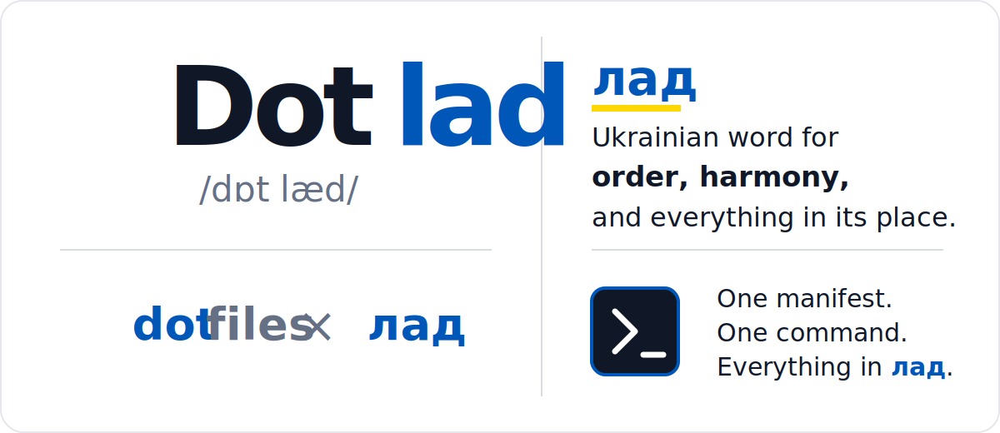
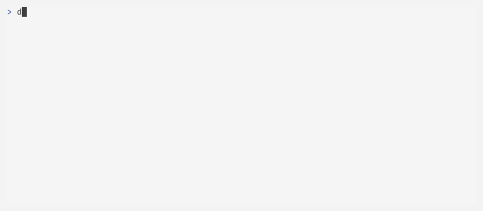

# Dotlad

[](https://github.com/vkarabinovych/dotlad/actions/workflows/ci.yml)
[](https://github.com/vkarabinovych/dotlad/releases/latest)
[](#requirements)
[](#requirements)
[](LICENSE)

<p align="center">
  <picture>
    <source media="(prefers-color-scheme: dark)" srcset=".github/assets/dotlad-name-dark.svg">
    <source media="(prefers-color-scheme: light)" srcset=".github/assets/dotlad-name-light.svg">
    
  </picture>
</p>

Dotlad is a manifest-driven macOS, Linux, and WSL CLI for installing packages
and deploying dotfiles from a repository. It provides one interface for
inspecting state, previewing changes, applying tools, and restoring replaced
files.

> [!NOTE]
> Dotlad is a personal project maintained primarily for my own use and shared
> as-is. It has no public support, roadmap, or response-time commitments.
> Forks are welcome. Until 1.0, minor releases may contain breaking changes;
> pin a release and review the changelog before updating.

<picture>
  <source media="(prefers-color-scheme: dark)" srcset=".github/assets/demo/cli-dark.gif">
  <source media="(prefers-color-scheme: light)" srcset=".github/assets/demo/cli-light.gif">
  
</picture>

## Why Dotlad

- Preview package and config actions before changing the machine.
- Apply every tool, a reusable profile, or an explicit selection.
- Run package-only or config-only workflows from the same manifests.
- Preserve machine-local JSON, TOML, and Git values with named resolvers.
- Maintain source-backed blocks inside larger machine-local files.
- Deploy files or directories as repository symlinks when direct editing is preferred.
- Back up replaced files automatically and restore them from the CLI or picker.
- Use the same runtime as a standalone command or a pinned Git submodule.

Dotlad deploys in one direction: project → system. The repository remains the
source of truth; Dotlad never captures live configuration back into the project.

## Requirements

Dotlad supports macOS, Linux, and WSL while remaining compatible with the stock
Bash 3.2 shipped with macOS. It has no TUI framework dependency. A real
terminal enables the interactive picker; `--plain` provides a read-only state
view for scripts and non-interactive shells.

A Nerd Font is optional but recommended for the picker's branding and
manifest-defined icons. Without one, state and keyboard behavior still work,
but icon glyphs may use the terminal's missing-character fallback.

Runtime dependencies are scoped to each tool and its resolver:

- Zsh is required only for the optional native completion integration.
- Homebrew on macOS or Linuxbrew on Linux and WSL installs declared `BREW`
  packages and missing resolver or manifest-defined requirements.
- `curl` or `wget` is required to install Dotlad or run another HTTPS installer.
- `sha256sum` or `shasum` is required to verify checksum-pinned downloads.
- `jq`, `yq`, or `git` is required only by the corresponding merge resolver.

Built-in resolvers declare their own commands. Use `REQUIRES` only for
additional commands needed by a particular tool's config deployment.

## Install

Install the latest tagged release on macOS, Linux, or WSL:

```bash
curl -fsSL https://raw.githubusercontent.com/vkarabinovych/dotlad/main/install.sh | bash
```

The installer uses `curl`, with `wget` as a fallback, and never invokes
`sudo`. It downloads the GitHub Release archive rather than cloning the
repository, verifies the published SHA-256 checksum, validates the archive,
and stages the runtime before replacing an existing managed installation.
It does not modify shell configuration.

To inspect the installer before running it:

```bash
installer="$(mktemp)"
curl -fsSL \
  https://raw.githubusercontent.com/vkarabinovych/dotlad/main/install.sh \
  -o "$installer"
less "$installer"
bash "$installer"
rm -f "$installer"
```

Pin an installation to a specific release when reproducibility matters:

```bash
curl -fsSL https://raw.githubusercontent.com/vkarabinovych/dotlad/main/install.sh |
  DOTLAD_VERSION=v0.9.0 bash
```

The archive-based installer supports Dotlad `v0.9.0` and newer. Earlier
releases predate this installation contract and are rejected explicitly.

By default, application files are installed under
`~/.local/share/dotlad`, and `~/.local/bin/dotlad` is a small managed launcher
for the runtime entrypoint. Override either absolute path independently:

```bash
curl -fsSL https://raw.githubusercontent.com/vkarabinovych/dotlad/main/install.sh |
  DOTLAD_INSTALL_DIR="$HOME/apps/dotlad" \
  DOTLAD_BIN_DIR="$HOME/bin" bash
```

If `~/.local/bin` is not already on `PATH`, add the matching line and restart
the shell:

```zsh
# ~/.zshrc
export PATH="$HOME/.local/bin:$PATH"
```

```bash
# ~/.bashrc on Linux/WSL; ~/.bash_profile for the stock macOS Bash
export PATH="$HOME/.local/bin:$PATH"
```

Rerun the one-line command to update to the latest release, or rerun the
pinned command with another `DOTLAD_VERSION`. Updates replace only the managed
application directory and command launcher; project manifests, deployed config,
and backups remain untouched. The log identifies upgrades, downgrades, and
same-version reinstalls with their exact versions. A failed transition restores
the previous runtime.

To uninstall the default layout, first confirm that the command is the managed
launcher, then remove those two application paths:

```bash
if grep -Fqx '# dotlad managed launcher' "$HOME/.local/bin/dotlad" &&
  grep -Fqx 'dotlad managed installation' \
    "$HOME/.local/share/dotlad/.dotlad-managed"; then
  rm "$HOME/.local/bin/dotlad"
  rm -rf "$HOME/.local/share/dotlad"
fi
```

For custom locations, remove the paths supplied through
`DOTLAD_BIN_DIR` and `DOTLAD_INSTALL_DIR` instead. Dotlad currently verifies
release archives against the SHA-256 file attached to the same GitHub Release.
This detects corruption and incomplete downloads, but the checksums are not
yet signed or published through an independent trust channel.

Enable native Zsh completion after initializing its completion system:

```zsh
autoload -Uz compinit && compinit
source <(dotlad completion zsh)
```

The completion function suggests commands, options, tools with their manifest
icons and descriptions, profiles with their parent and directly declared tools,
and restore points for the active project. Project-specific wrappers can
register their own command name and fixed roots with
`source <(mydot completion zsh)`.

## Create a first project

A Dotlad project needs a `tools/` directory. Each tool has a strict,
non-executable `tool.conf` and may include one or more config payloads:

```bash
mkdir -p "$HOME/dotfiles/tools/starship/files"

cat > "$HOME/dotfiles/tools/starship/files/starship.toml" <<'EOF'
format = "$directory$character"
EOF

cat > "$HOME/dotfiles/tools/starship/tool.conf" <<'EOF'
NAME="starship"
DESC="Cross-shell prompt configuration."
ICON="★"
PLATFORMS="macos linux"
BREW="starship"
[config.main]
SOURCE="files/starship.toml"
DEST="$HOME/.config/starship.toml"
EOF
```

Inspect the project and preview the exact action before applying it:

```bash
dotlad -C "$HOME/dotfiles" --plain
dotlad -C "$HOME/dotfiles" plan starship
dotlad -C "$HOME/dotfiles" starship
```

The first two commands are read-only. The final command shows a diff, asks for
confirmation, installs the package when missing, backs up an existing
destination, and deploys the config.

Run `dotlad -C "$HOME/dotfiles"` without a command to open the picker. `-C` is
optional when the current directory is already the project root.

## Project model

```text
my-dotfiles/
├── tools/
│   └── starship/
│       ├── tool.conf
│       └── files/starship.toml
└── profiles/
    └── base.conf
```

Tools may declare packages, one or more named config sections, or both. Each
`[config.<name>]` chooses its own `SOURCE`, `DEST`, and optional `RESOLVER`.
`PLATFORMS` limits a tool to `macos`, `linux`, or `wsl`. Omitting it keeps the
default `macos linux`; Linux tools also run on WSL, while `wsl` selects WSL
only. Homebrew casks must explicitly use `PLATFORMS="macos"`.
The resolver defaults to `copy`, which copies a file or mirrors a directory
exactly. Use `symlink` to point a destination at the repository source, or a
merge resolver for machine-local file values. The `inject` resolver maintains
one metadata-marked source block while preserving the rest of a destination.

Profiles are optional named tool selections with single-parent inheritance:

```bash
# profiles/base.conf
extends=""
tools="starship git nvim"
```

See [Adding or changing a tool](docs/adding-a-tool.md),
[Profiles](docs/profiles.md), and the [complete example project](examples/)
for the schemas, validation rules, and copy, mirror, merge, symlink,
multi-config, and package-only manifests.

## CLI at a glance

| Command                           | Purpose                                     |
| --------------------------------- | ------------------------------------------- |
| `dotlad`                          | Open the interactive tool picker            |
| `dotlad --plain`                  | Print read-only tool and backup state       |
| `dotlad <tool>…`                  | Apply named tools                           |
| `dotlad profile <name>`           | Apply a profile and inherited tools         |
| `dotlad all`                      | Apply every tool                            |
| `dotlad plan [target]`            | Preview actions, requirements, and blockers |
| `dotlad --dry-run <action>`       | Plan a normal tool/profile/all action       |
| `dotlad brewfile`                 | Generate a Homebrew Bundle file             |
| `dotlad backups`                  | List available restore points               |
| `dotlad restore <name>`           | Restore a restore point                     |
| `dotlad backup delete <name>`     | Delete a restore point                      |
| `dotlad --packages-only <action>` | Install packages without deploying config   |
| `dotlad --config-only <action>`   | Deploy config without installing packages   |
| `dotlad --symlink <action>`       | Default implicit config deployment to links |

See the [CLI reference](docs/cli.md) for option scope, JSON plans, picker
controls, automation behavior, and exit statuses.

## Use as a pinned submodule

A consumer project can pin Dotlad instead of requiring a global installation:

```bash
git submodule add https://github.com/vkarabinovych/dotlad.git vendor/dotlad
git submodule update --init --recursive
```

Expose a project-local wrapper:

```bash
#!/usr/bin/env bash
set -euo pipefail
ROOT="$(cd "$(dirname "${BASH_SOURCE[0]}")" && pwd)"
export DOTLAD_COMMAND_NAME="my-dotfiles"
export DOTLAD_DISPLAY_NAME="My Dotfiles"
exec "$ROOT/vendor/dotlad/dotlad" "$@" \
    -C "$ROOT" --backup-root "$HOME/.my-dotfiles-backup"
```

The standalone command and embedded entrypoint load the same runtime code.

## Safety model

Before deployment, Dotlad validates every manifest and the complete selected
batch. Destinations must be non-overlapping strict descendants of `$HOME`, and
existing parent symlinks cannot redirect writes outside it. Source payloads
cannot contain symlinks or special filesystem entries.

File writes are atomic. Directory tools are staged and swapped as a
transaction; their destinations are exact mirrors, so stale files are backed
up and pruned. Symlinks are also staged and swapped, and the repository must
remain at the same absolute path while they are deployed. Merge resolvers
retain unrelated live values while repository-declared values win. Restore
operations back up the current version before replacing it.

Use `dotlad plan` for a read-only preflight and keep `--yes` for reviewed
automation rather than exploratory runs.

## Documentation

- [CLI reference](docs/cli.md) — commands, options, plans, and picker controls
- [Adding or changing a tool](docs/adding-a-tool.md) — schema and deployment semantics
- [Profiles](docs/profiles.md) — reusable selections and inheritance
- [Troubleshooting](docs/troubleshooting.md) — common setup and preflight failures
- [Architecture](docs/architecture.md) — runtime boundaries and execution flow
- [Development and releases](docs/development.md) — validation, packaging, and release process

## Development

```bash
/bin/bash scripts/check.sh
/bin/bash tests/run.sh
```

See [CONTRIBUTING.md](CONTRIBUTING.md) for the local development workflow,
[SUPPORT.md](SUPPORT.md) for the maintenance policy, and
[SECURITY.md](SECURITY.md) for private vulnerability reporting. Release notes
are maintained in [CHANGELOG.md](CHANGELOG.md).

Released under the [MIT License](LICENSE).
